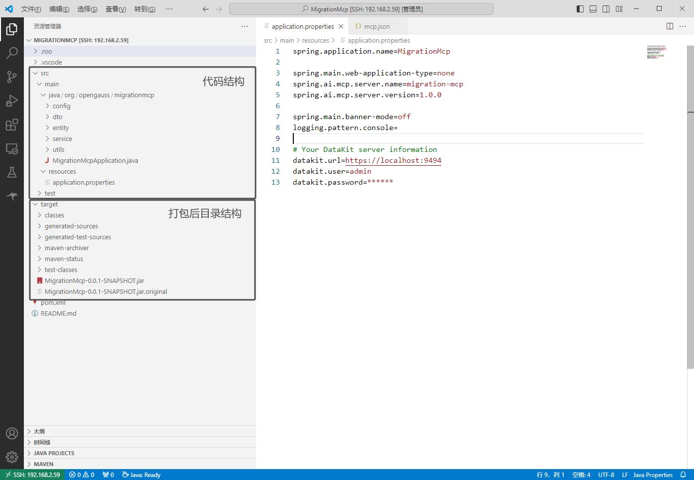
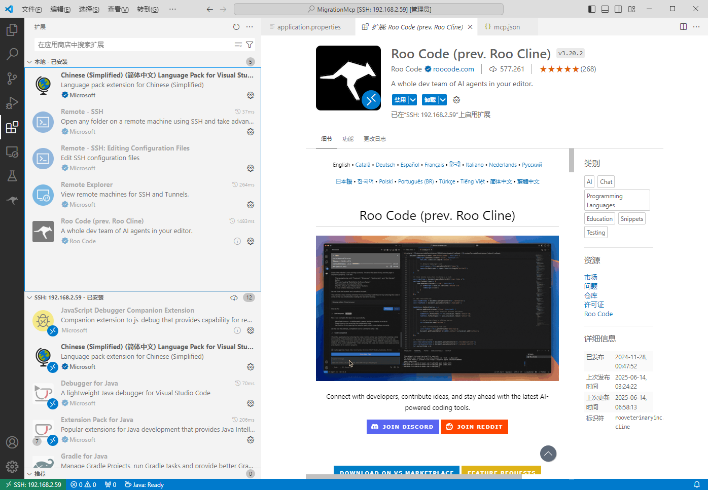
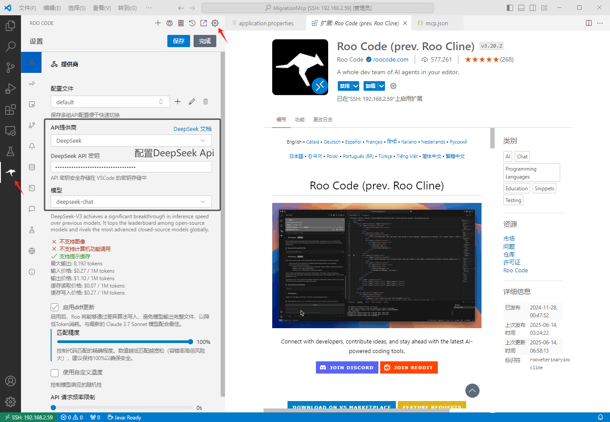
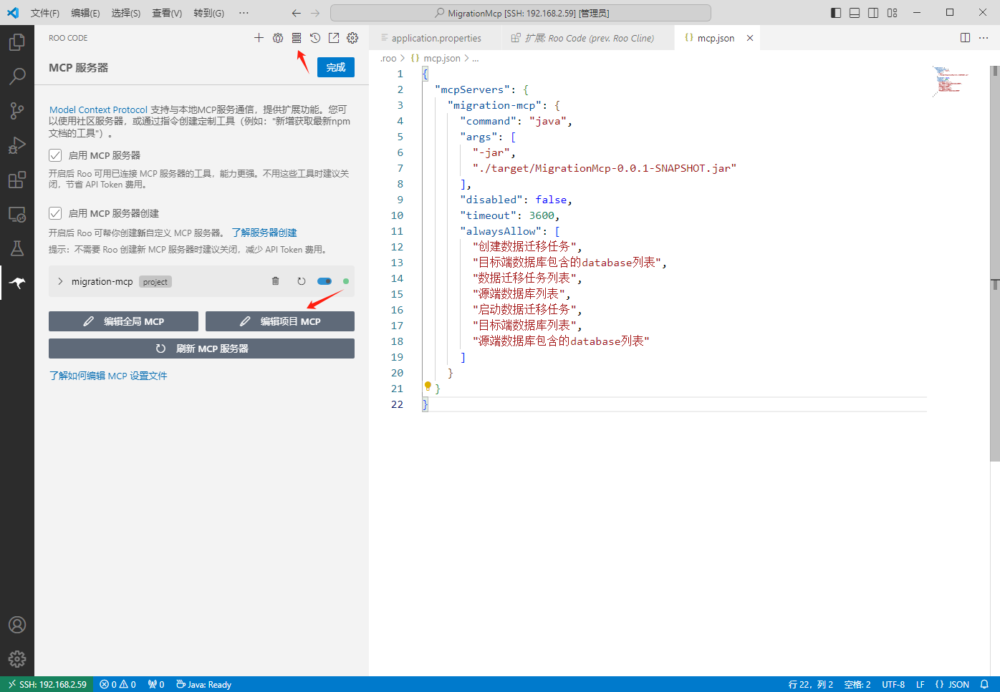
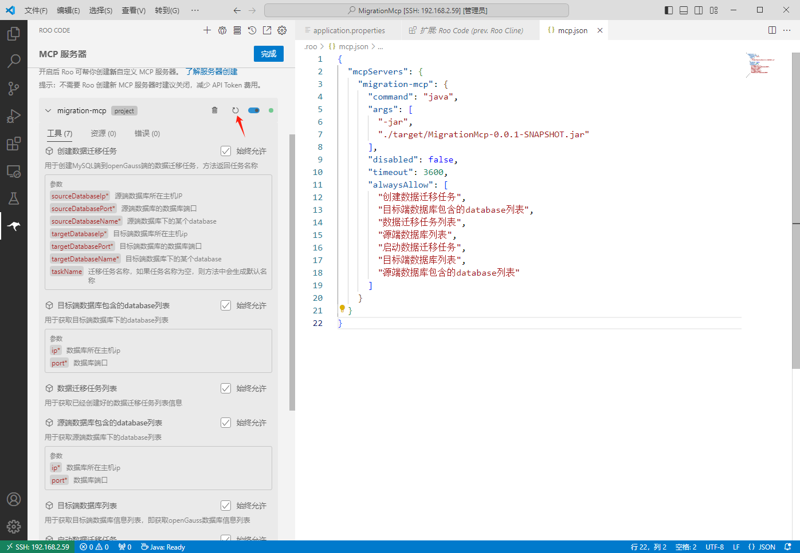
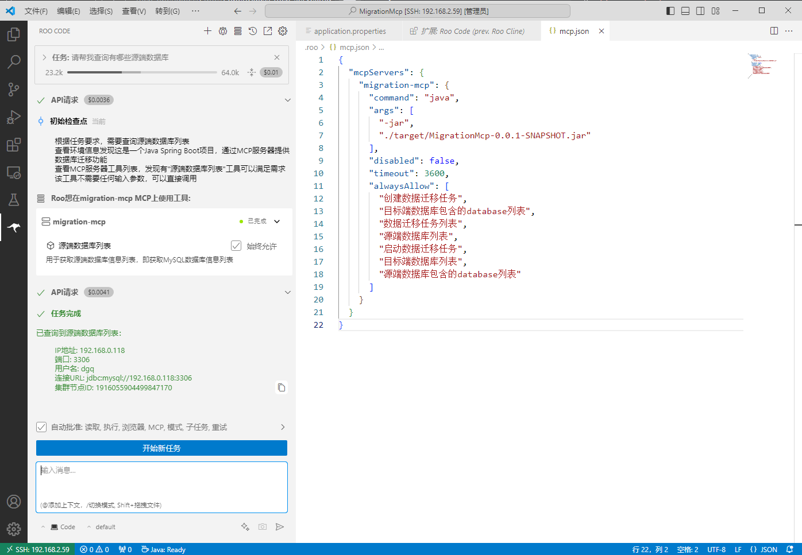

# DataKit Mcp

## DataKit Mcp服务简介

DataKit Mcp服务依托openGauss DataKit的数据迁移功能，实现了MySQL数据库到openGauss数据库的智能全自动数据迁移能力。

## DataKit迁移环境准备

1. 准备源端和目标端数据库

   准备源端MySQL数据库服务，准备目标端openGauss数据库服务。openGauss数据库的搭建请参考openGauss官网：`https://opengauss.org/zh/`

2. 搭建DataKit服务

   参考 `https://gitcode.com/opengauss/openGauss-workbench` 仓库中的README文档，或openGauss官网进行搭建。

3. 导入数据库

   将第一步准备的MySQL和openGauss数据库添加到DataKit服务“实例管理”中。

4. 准备迁移执行机

   通过DataKit服务“数据迁移”功能，完成迁移执行机安装，可参考 `https://gitcode.com/opengauss/openGauss-workbench/blob/master/plugins/data-migration/README.md` 文档，或openGauss官网进行安装。

注意：使用MCP进行数据迁移前，建议先通过DataKit的Web页面熟悉迁移业务流程和操作，以便理解当前MCP服务支持的各项功能。

## MCP服务搭建

1. 准备Java环境

   由于DataKit Mcp使用的开发语言是Java，因此需要在开发环境中准备JDK21环境和maven3.8+环境，注意配置好环境变量。Linux环境或Windows环境均可。

2. 下载源码

   下载当前项目代码，使用IDE工具打开项目，注意DataKit Mcp的项目根目录为datakit_mcp_server目录，此处以在VSCode中打开项目为例。

   

3. 配置DataKit服务信息

   修改项目中的`src/main/resources/application.properties`文件，配置其中的DataKit服务相关内容，其他配置项请勿修改。

   根据**环境准备**搭建的DataKit服务，配置如下内容：

   ```properties
   # Your DataKit server information
   datakit.url=https://localhost:9494
   datakit.user=admin
   datakit.password=******
   ```

4. 打包项目

   配置完成后，在datakit_mcp_server目录下，使用`mvn clean package -DskipTests`命令对DataKit MCP进行打包，打包成功后可以在项目目录下看到`target/MigrationMcp-0.0.1-SNAPSHOT.jar`文件。

5. 配置MCP服务

   在VSCode中下载`Roo Code`插件，并打开插件，点击`设置`菜单，配置DeepSeek的Api，配置完成后保存。

   

   

   然后点击插件中的`MCP Servers`菜单，打开MCP管理页面。进一步点击页面中的`编辑项目MCP`按钮，则自动打开`mcp.json`配置文件，修改文件内容如下：

   ```json
   {
     "mcpServers": {
       "migration-mcp": {
         "command": "java",
         "args": [
           "-jar",
           "./target/MigrationMcp-0.0.1-SNAPSHOT.jar"
         ],
         "disabled": false,
         "timeout": 3600,
         "alwaysAllow": [
           "创建数据迁移任务",
           "目标端数据库包含的database列表",
           "数据迁移任务列表",
           "源端数据库列表",
           "启动数据迁移任务",
           "目标端数据库列表",
           "源端数据库包含的database列表"
         ]
       }
     }
   }
   ```
   配置页面示例如下：

   

6. 启动MCP服务

   配置完成后，插件页面中会加载出`migration-mcp`项目，点击项目菜单中的刷新按钮，即可启动或重启DataKit MCP服务。MCP服务启动成功后，可以点击`migration-mcp`项目中的下拉按钮，看到MCP服务支持的各项功能，成功示例如下：

   

   MCP服务启动成功后，点击MCP服务管理页面的`完成`按钮，则完成MCP服务配置和启动，并自动进入到Roo Code插件的会话窗口。

7. 使用MCP服务

   在Roo Code插件的会话框中输入自然语言描述的MCP功能使用指令，即可使用MCP服务。使用示例如下：

   

## 支持的功能

1. 查询DataKit服务中有哪些源端数据库，即MySQL数据库；
2. 查询DataKit服务中有哪些目标端数据库，即openGauss数据库；
3. 查询DataKit服务中的某个MySQL数据库服务中有哪些database；
4. 查询DataKit服务中的某个openGauss数据库服务中有哪些database；
5. 创建一个数据迁移任务；
6. 启动一个数据迁移任务；
7. 查询DataKit服务中的所有数据迁移任务。

## 使用示例

你可以尝试使用类似如下自然语言指令，使用MCP服务的功能：

1. 请帮我列出所有的源端和目标端数据库。
2. 请帮我查询在ip:port的数据库中有哪些database。
3. 请创建一个ip1:port1的db1到ip2:port2的db2的数据迁移任务。
4. 请帮我启动上一步创建的迁移任务。

## 注意事项

1. DataKit MCP服务，当前仅为DataKit数据迁移功能接入MCP服务的demo，目前支持的功能有限，如感知迁移进度，添加源端和目标端数据库等功能，还需要使用DataKit的原有Web页面操作。
2. DataKit MCP服务启动需要在**环境准备**搭建的DataKit服务已启动的前提下，当DataKit重启时，DataKit MCP也需要重新启动。
3. DataKit MCP长时间未使用时，建议使用前重启，避免MCP内部存储的DataKit token超时，引起的MCP服务不可用问题。
4. DataKit MCP服务的正常运行，依赖于**环境准备**过程中导入的MySQL和openGauss数据库，以及安装好的迁移执行机。
5. DataKit MCP打包过后，请勿修改DataKit服务的admin用户密码，否则需要重新从服务搭建的**配置DataKit服务信息**步骤开始重新配置，然后打包启动。