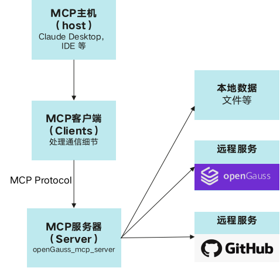
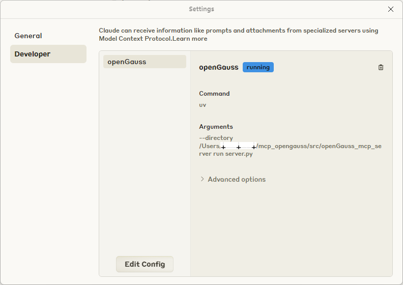
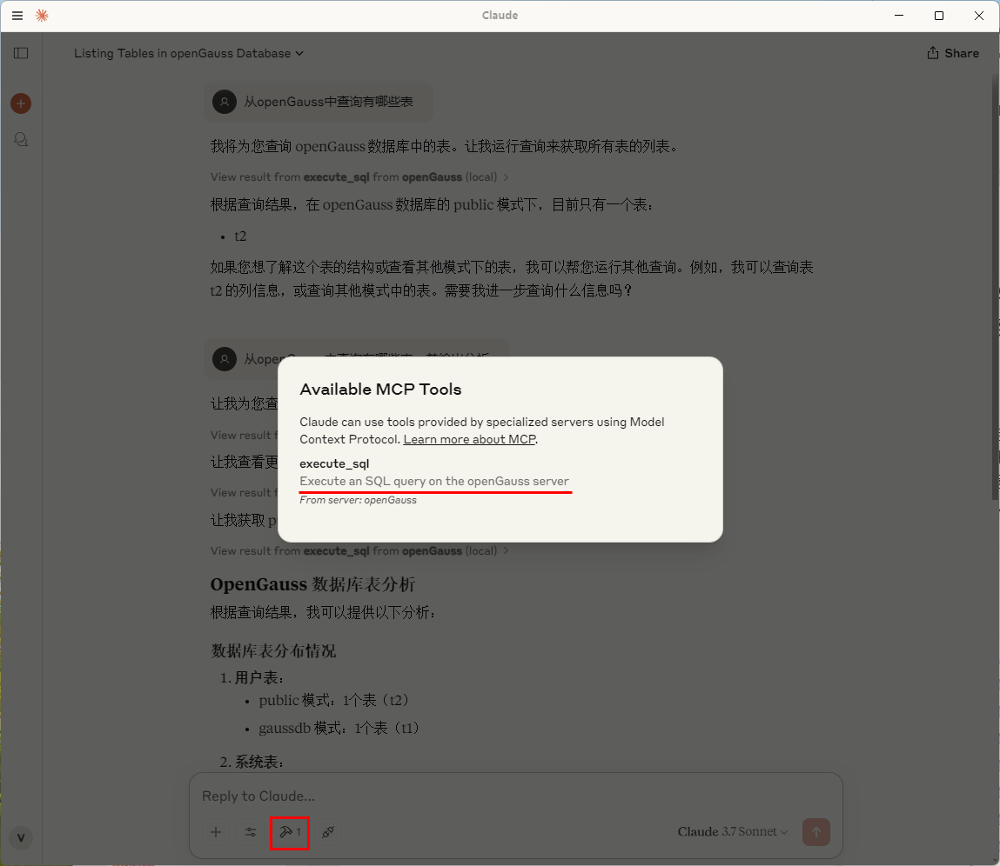

# MCP + openGauss
随着AI从静态推理向动态交互演进，智能体（Agent）逐渐成为焦点。Agent不仅能够调用LLM进行推理，还能访问数据库、调用API、执行任务。然而，当前LLM和Agent之间缺乏标准化交互协议, 每个新数据源都需要自定义实现，使得真正互联的系统难以扩展。MCP(Model Context Protocol, 模型上下文协议)解决了这一挑战，MCP是为LLM和Agent系统设计的标准化交互框架，使LLM可以与外部数据库、API和工具进行高效交互。

## openGauss + MCP + LLM 架构

**图 1**  openGauss + MCP + LLM 架构
<div style="display:flex;justfy-content:center;">  
    
</div>

## 快速搭建openGauss + MCP + LLM的AI Agent应用
### 环境准备
- 安装python3环境，安装uv。
- 部署并启动[openGauss数据库](https://docs.opengauss.org/zh/docs/latest/docs/InstallationGuide/InstallationGuide.html)。可以通过容器安装在PC启动openGauss数据库(openGauss官网：学习->文档->最新开发版本->安装指南->容器镜像安装）
- 下载Claude Desktop配合MCP协议进行问答操作。

### 获取openGauss_mcp_server源码
访问链接, 获取[openGauss_mcp_server源码](https://gitcode.com/opengauss/mcp-opengauss)，当前版本为（0.1.0）。

### 配置参数
- 打开Claude Desktop设置，编辑配置文件, 设置mcp server启动路径（/src/openGauss_mcp_server)

    环境变量：
    | 名称 | 描述 |
    |-------|-------|
    |OPENGAUSS_HOST|openGauss数据库host|
    |OPENGAUSS_PORT|openGauss数据库端口号|
    |OPENGAUSS_USER|openGauss用户名|
    |OPENGAUSS_PASSWORD|openGauss数据库连接密码|
    |OPENGAUSS_DBNAME|openGauss数据库名称|
    |ENABLE_MEMORY|记忆系统开关，1表示开启，0表示关闭|
    |EMBEDDING_MODEL_PROVIDER| 模型提供商，默认huggingface|
    |LOCAL_MODEL_DIR|本地嵌入模型路径|
    |REMOTE_MODEL_NAME|远程嵌入模型名称，默认BAAI/bge-small-en-v1.5|

**图 2**  Claude Desktop配置页面
<div style="display:flex;justfy-content:center;">
    
</div>

- Stdio模式 <br>
在支持MCP的客户端中，将下面内容填入配置文件，比如在Claude Desktop中可以通过Edit Config增加配置

```
{
    "mcpServers": {
        "openGauss": {
            "command": "uv",
            "args": [
            "--directory",
            "path/to/openGauss_mcp_server",
            "run",
            "server.py"
            ],
            "env": {
                "OPENGAUSS_HOST": "localhost",
                "OPENGAUSS_PORT": "8888",
                "OPENGAUSS_USER": "your_username",
                "OPENGAUSS_PASSWORD": "your_password",
                "OPENGAUSS_DBNAME": "your_database",
                "ENABLE_MEMORY": "0"
            }
        }
    }
}
```

- SSE模式<br>
在SSE模式下，允许多个MCP客户端共享一台服务器，可能是远程服务器。在启动MCP服务前请先配置好相关的环境变量。
```
cd src/openGauss_mcp_server
python3 -m server --transport sse --sse_port <yourport> --sse_host 0.0.0.0
```

MCP服务启动后就可以更新MCP客户端的配置：
```
{
  "mcpServers": {
    "openGauss":{
      "type":"sse",
      "url":"http://<yourip>:<yourport>/sse"
        }
  }
}
```

## openGauss MCP工具
- 执行SQL语句
- 查询数据库中所有表格
- 查询表格部分内容
- 查询SQL语句的执行计划
- 创建BM25全文索引
- 带标量的全文搜索
- 创建向量索引
- 带标量的向量搜索
- 通过全文、向量、标量进行混合搜索
- 查询openGauss官网文档
- 用户记忆系统


## AI服务集成
### 重新启动Claude Desktop
可以看到可用MCP Tool, 执行sql通过openGauss server

**图 3**  Claude Desktop可用MCP Tool
<div style="display:flex;justfy-content:center;">
    
</div>

### 使用Cluade Desktop通过openGauss进行问答
**图 4**  Claude Desktop问答演示
<div style="display:flex;justfy-content:center;">
    
</div>

### 示例
问题一：查看数据库的所有表格
```sql
tablename,tableowner,schemaname
documents,test2,public
og_mcp_memory,test2,public
test_vectors_5d,test2,public
```

问题二：混合搜索（全文+向量+标量）<br>
对表格test_vectors_5d进行混合搜索，要求全文搜索的权重是0.7，返回参数不需要返回向量列
```json
{
  "id": 1,
  "title": "Document A",
  "description": "First test document",
  "score": 0.0870114043354988,
  "bm25_norm": 1.0,
  "vector_norm": 1.0,
  "hybrid_score": 1.0
}

{
  "id": 3,
  "title": "Document C",
  "description": "Third test document",
  "score": 0.0870114043354988,
  "bm25_norm": 1.0,
  "vector_norm": 0.9974683567754559,
  "hybrid_score": 0.9992405070326367
}
```

问题三：用户记忆系统 <br>
1）我喜欢吃火锅，平时住在杭州
```
AI：用户提供了个人偏好信息（喜欢吃火锅，住在杭州），这应该被存储到个人记忆系统中。我需要使用og_memory_insert工具来存储这些信息。
...
```

2）推荐好喝的饮料
```
AI：让我先使用og_memory_query工具来查询用户的饮料偏好信息。
...
```